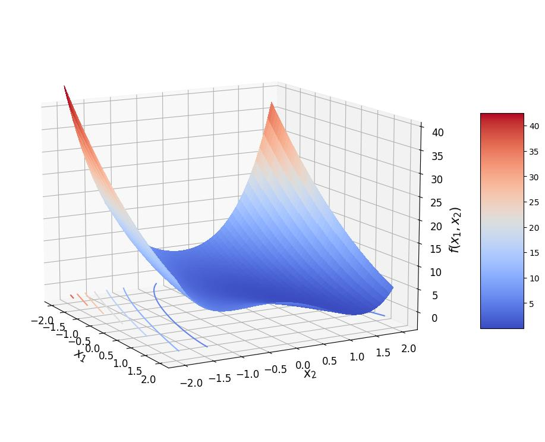
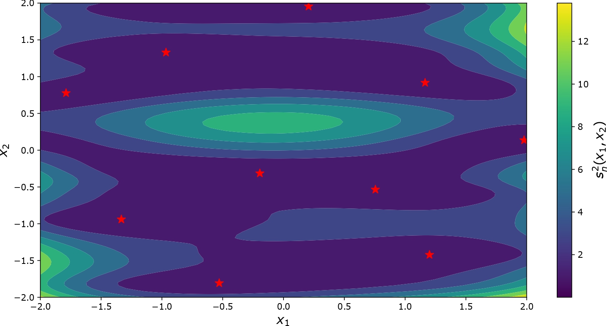
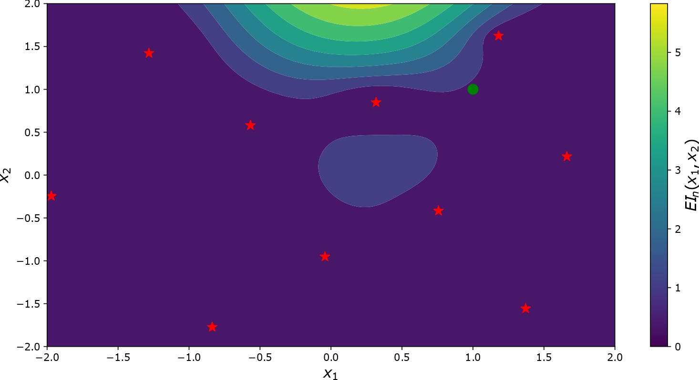
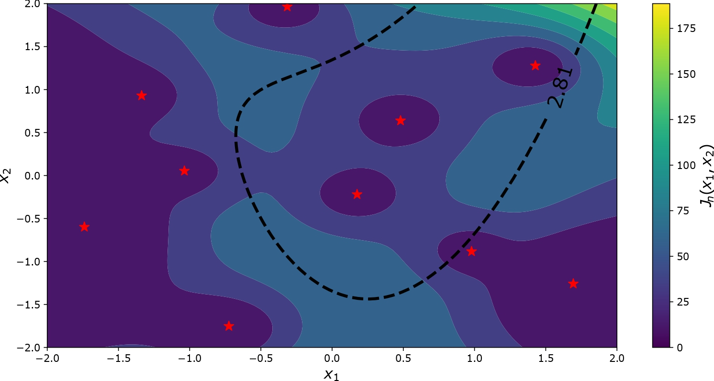

<!--
Copyright 2021 IRT Saint Exupéry, https://www.irt-saintexupery.com

This work is licensed under the Creative Commons Attribution-ShareAlike 4.0
International License. To view a copy of this license, visit
http://creativecommons.org/licenses/by-sa/4.0/ or send a letter to Creative
Commons, PO Box 1866, Mountain View, CA 94042, USA.
-->
# Active learning

## What active learning is

### Introduction

Active learning techniques are iterative methods that aim to sequentially estimate various
quantities of interest:
optimas, contours, failure probabilities, quantiles, expected values, *etc*.
These methods generally start by constructing a rough surrogate model
(an approximation of a costly exact physical model much faster to run).
Then, they iteratively look for new simulations to run,
and update the surrogate model
and the estimated target quantities until a budget or accuracy criterion is reached.
This search is guided by an acquisition criterion,
also called infill criterion,
to be minimized or maximized.
This approach is inspired by
the efficient global optimization (EGO) algorithm [@jones1998efficient].

### Surrogate modeling

Surrogate models[@forrester2008engineering] are approximations of a costly exact model
$f:\mathbf{x} \in \mathbb{X}\subset\mathbb{R}^d\mapsto y \in \mathbb{R}$ much faster to run.
There are many types of surrogates,
but one of the most popular,
in particular in the active learning literature,
is the Kriging model, a.k.a. Gaussian processes (GP) regressor [@williams2006gaussian].
One reason is that GP models provide a characterization of the prediction uncertainty.
The exact simulator $f$ is considered as a realization of a GP, $F$,
with trend $m : \mathbb{X} \rightarrow \mathbb{R}$
and covariance kernel $c : \mathbb{X}\times \mathbb{X} \rightarrow \mathbb{R}$.
Conditioned by $n$ observations $\mathcal{A}_n = \{(\mathbf{x}_1,y_1),\dots,(\mathbf{x}_n,y_n)\}$,
$F_n  = F|\mathcal{A}_n$ is also a GP,
with trend $m_n(\cdot)$ and covariance function $c_n(\cdot,\cdot)$
that express differently depending on whether the trend function is known or not.
The variance of the output prediction is denoted by $s_n^2(\cdot) = c_n(\cdot,\cdot)$.

Note that the implementation of active learning strategies is not limited to the use of GP surrogates.
In this case,
a critical step of the method is the characterization
of the uncertainty of the surrogate prediction,
which can be achieved using bootstrap-based techniques[@BenSalem2015universal].

#### The Rosenbrock function

The Rosenbrock function[@molga2005test],
which will be used for illustrative purposes,
expresses as :

$$ f(\mathbf{x}) = \sum_{i = 1}^{d-1} [100(x_{i+1} - x_i^2)^2 +(1-x_i)^2], $$

with $\mathbf{x}$ a $d$-dimensional input, $d \geqslant 2$.
An illustration of the function
with a two-dimensional input is depicted below:

<figure markdown="span">
{height=150px width="75%"}  <figcaption>
Bidimensional Rosenbrock function
</figcaption>
</figure>

In the case of quantile estimation,
$x_1$ and $x_2$ are replaced by
the independent random variables $X_1$ and $X_2$
uniformly distributed over $[-2,2]$.

### Acquisition criteria

One of the key step of the active learning methodology is the choice of the acquisition criterion
that guides the enrichment of the surrogate model.
It is noted $J_n(\cdot)$ in the following.
Several criteria have been developed for different purposes [@viana2021surrogate].
Typical applications of this methodology include the improvement of the surrogate model,
the minimization of black-box functions
and contour estimation, among others.
Some popular criteria are detailed next for the objectives listed above.

#### Improving the quality of the surrogate

A straightforward method to improve a surrogate model consists in choosing as enrichment points those
with the highest predicted uncertainty,
giving for the infill criterion $J_n(\cdot)$ :

$$ J_n(\mathbf{x}) = s_n^2(\mathbf{x}),$$

<figure markdown="span">
{{height=150px width="75%"}
<figcaption>
Level plot of the predicted uncertainty. 
The learning points are denoted with a red star.
</figcaption>
</figure>

Note in this figure that,
the predicted uncertainty (in fact the infill criterion) is the highest in the areas
where the amount of learning points for the training of the surrogate is the smallest.

#### Finding optimas

One of the most popular acquisition criterion to minimize (alternatively to maximize) black-box functions
is the expected improvement [@jones1998efficient] defined as:

$$ J_n(\mathbf{x}) =  \text{EI}_n(\mathbf{x})  = \mathbb{E}[\max(\mathbf{y}_n - F_n(\mathbf{x}),0)],$$

where the expectation is taken with respect to
the distribution of the conditioned GP $F_n(\cdot)$.
In the previous equation,
$\mathbf{y}_n$ corresponds to the output values of the database $\mathcal{A}_n$
and stands for $\mathbf{y}_n = (y_i)_{i \in [1, n]}$.

<figure markdown="span">
{{height=150px width="75%"}
<figcaption>
Level plot of the expected improvement. 
The learning points are denoted with a red star.  
The global minimum is set in green.
</figcaption>
</figure>

In this figure,
some learning points are already close to the global minimum,
so the infill criterion rather seeks here to improve the GP overall prediction.

#### Estimating contour sets

A usual criterion to estimate the level set[@ranjan2008sequential] associated to value $a$ is :

$$ J_n(\mathbf{x}) =  \mathbb{E}[\max((2 s_n^2(\mathbf{x})) -\vert{a - F_n(\mathbf{x})}\vert^2,0)],$$

where the expectation is taken with respect to
the distribution of the conditioned GP $F_n(\cdot)$.
With an appropriate choice of $a$,
this criterion can be used to estimate quantiles
or failure probabilities.
In the following,
it is implemented to estimate the $35\%$ quantile of the Rosenbrock function.

<figure markdown="span">
{{height=150px width="75%"}
<figcaption>
Level plot of the acquisition criterion for level set estimation. 
The learning points are denoted with a red star. 
The level set associated to the quantile to estimate is drawn in black.
</figcaption>
</figure>

In this figure,
the areas with the highest acquisition criterion values refer to those
that are located around the level set corresponding to the target quantile
(which is here the objective study)
and far from the learning points
(where knowledge is already available).

### Parallelization

Most of the time,
a single observation is added at the different steps of the active learning algorithm.
However,
to reduce the number of iterations of the active learning strategy,
a batch of several points can be added [@ginsbourger2010kriging]
instead of considering a single one.
This implies several changes,
among which the expression of the infill criterion and its maximization.
Let emphasize that
parallelizing the active learning methodology significantly increases the computational burden
which can still be alleviated by considering approximated heuristics [@ginsbourger2010kriging].

A key challenge of this method is defining the size of the batch of points added at each iteration.
In theory,
it should be as high as possible,
because for a fixed number of black-box evaluations,
the higher it is,
the lower the number of iterations is.
However,
this is synonymous with an increase of the numerical complexity of the method,
and a balance must be therefore struck between the computational costs
and the efficiency of the active learning strategy.

In the following,
we present the active learning functionalities available in [gemseo-mlearning][gemseo_mlearning.active_learning].

## API

The [ActiveLearningAlgo][gemseo_mlearning.active_learning.active_learning_algo.ActiveLearningAlgo] class
defines an active learning algorithm.

Given a coarse regressor $\hat{f}$ (a.k.a. surrogate model)
of a model $f$ (a.k.a. substituted model),
this algorithm updates this regressor sequentially
from input-output points maximizing (or minimizing) an acquisition criterion
(a.k.a. infill criterion).

There are five families of acquisition criteria:

- [Minimum][gemseo_mlearning.active_learning.acquisition_criteria.minimum.minimum.Minimum]:
  make the minimum of the surrogate model
  tends towards the minimum of the substituted model
  when the number of acquired points tends to infinity,
- [Maximum][gemseo_mlearning.active_learning.acquisition_criteria.maximum.maximum.Maximum]:
  make the maximum of the surrogate model
  tends towards the maximum of the substituted model
  when the number of acquired points tends to infinity,
- [LevelSet][gemseo_mlearning.active_learning.acquisition_criteria.level_set.level_set.LevelSet]:
  make a level set of the surrogate model
  tends towards the corresponding level set of the substituted model
  when the number of acquired points tends to infinity,
- [Quantile][gemseo_mlearning.active_learning.acquisition_criteria.quantile.quantile.Quantile]:
  make a quantile of the surrogate model
  tends towards the quantile of the substituted model
  when the number of acquired points tends to infinity,
- [Exploration][gemseo_mlearning.active_learning.acquisition_criteria.exploration.exploration.Exploration]:
  make the error of the surrogate model tends towards zero
  when the number of acquired points tends to infinity.

Many of these acquisition criteria consider that
the surrogate model is a Gaussian process (GP) regressor $\hat{f}$
and are expressed from realizations or statistics of this GP $\hat{F}$,
*e.g.* its mean $m_n(x)$ and its variance $c_n(x,x)$ at $x$
where $c_n(\cdot,\cdot)$ is its covariance function.
These statistics and realizations can be obtained using the
[KrigingDistribution][gemseo_mlearning.active_learning.distributions.kriging_distribution.KrigingDistribution]
class
which can be built from any regressor deriving from
[BaseRandomProcessRegressor][gemseo.mlearning.regression.algos.base_random_process_regressor.BaseRandomProcessRegressor].
By *distribution* we mean
the probability distribution of a random function of which $f$ is an instance.
For non-GP regressors,
this distribution is not a random process from the literature
but an empirical distribution based on resampling techniques
and is qualified as *universal* by its authors:
[RegressorDistribution][gemseo_mlearning.active_learning.distributions.regressor_distribution.RegressorDistribution].

A basic use of this class is

1. instantiate
   the [ActiveLearningAlgo][gemseo_mlearning.active_learning.active_learning_algo.ActiveLearningAlgo]
   from an input space of type [DesignSpace][gemseo.algos.design_space.DesignSpace],
   a [BaseRegressor][gemseo.mlearning.regression.algos.base_regressor.BaseRegressor]
   and the name of a family of acquisition criteria
   (a default acquisition criterion will be set accordingly),
2. update the regressor with the method ``acquire_new_points``,
3. get the updated regressor with the attribute ``regressor``.

For more advanced use,
it is possible to change the acquisition algorithm,
i.e. the optimization algorithm to minimize or maximize the acquisition criterion,
as well as the acquisition criterion among the selected family.

Lastly,
the [visualization][gemseo_mlearning.active_learning.visualization] subpackage
offers plotting capabilities
to draw the evolution of both the surrogate model and the acquisition criterion.
